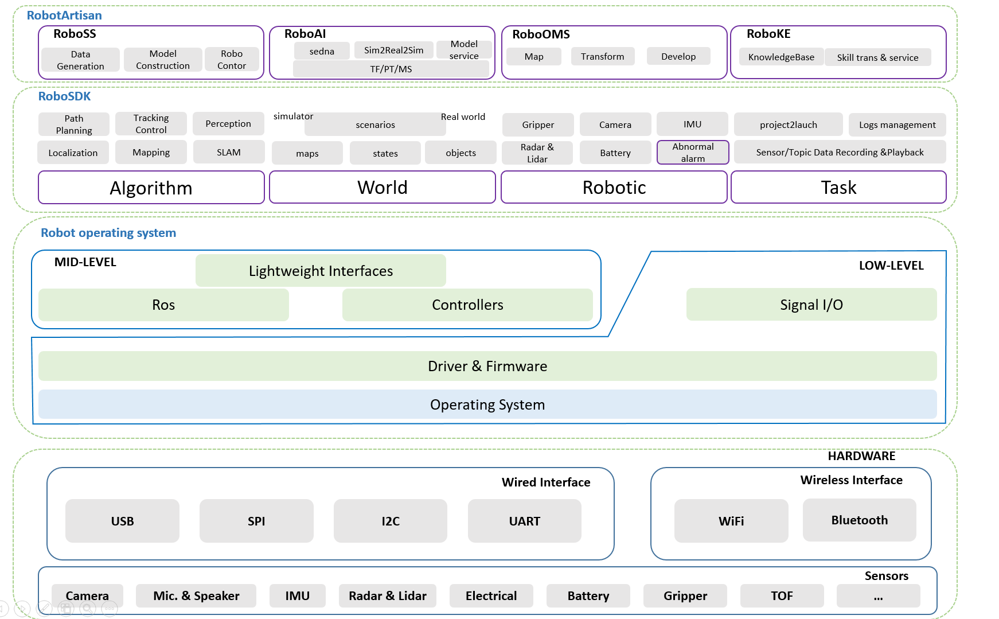
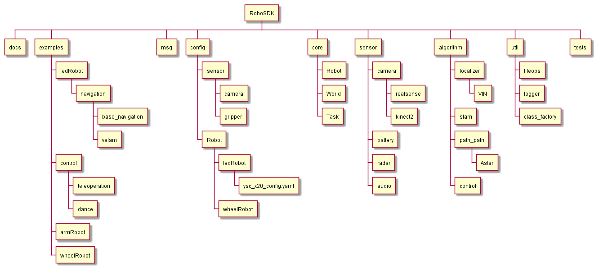
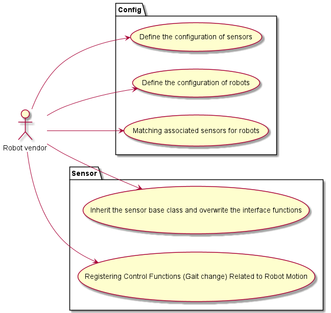
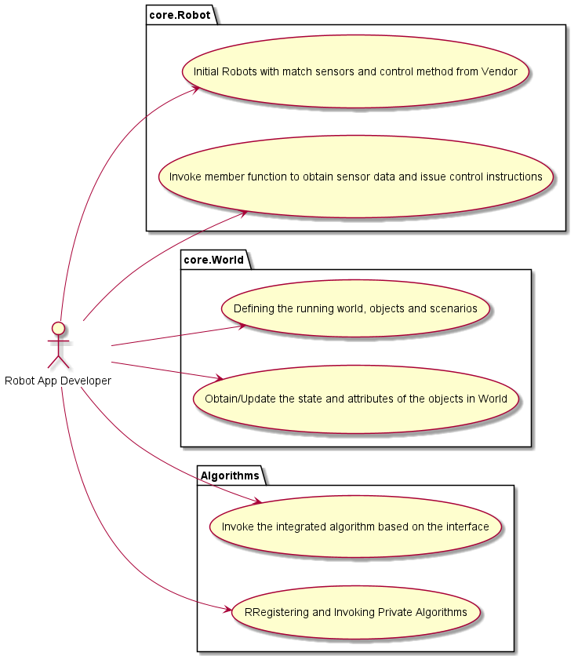
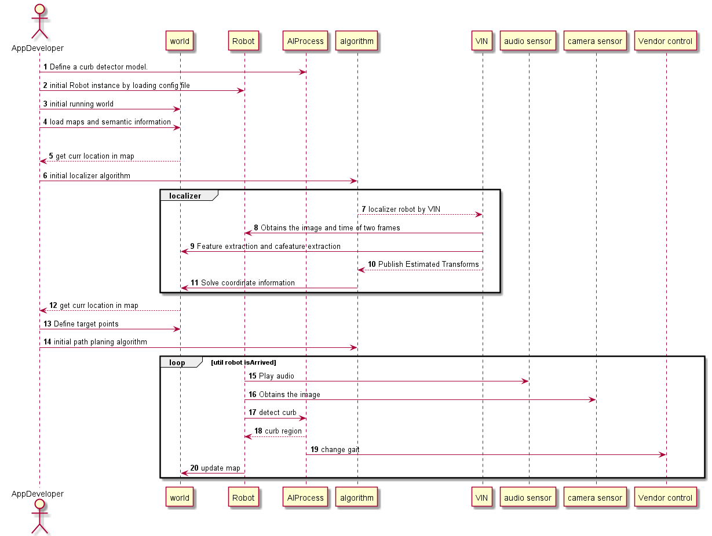

## RobotSDK

### What is RobotSDK

`RobotSDK` is a light weight, high-level interface which provides hardware independent APIs for robotic control and perception.
The goal of this project is to abstract away the low-level controls for developing APPs that runs on an industrial robot in an easy-to-use way.

### Features

`RobotSDK` provide the following features:

- Defining the Running World
    - A `World` represent an environment which the robot launch, such as interactive maps, active objects and scenarios.
    - Compatible with mainstream simulator model such as Gazebo.
    - Support to obtain the `location` and `attributes` of the objects, e.g. `Robot`.
    
- Sensor-Based Control for Registered Robots
    - Object-oriented, unified interface for equivalent sensors, such as : `Camera`, `Lidar`, `IMU` and `Audio`. 
      Therefore, they are guaranteed to have the same interface defined by the base class, for example, 
      `Camera` would have `get_rgb`, `get_depth` as its member function, and their behavior would be the same across hardware.
    - A `Robot` instance consists of multiple components of sensors which were extended the `BaseClass` respectively. `Robot` and `Sensor` is one-to-many.
    - A `Robot` is controlled by invoking the `Sensor` interface. The robots are managed by combining multiple configurations of each sensor.
    - Interconnection with Vendor-defined interface, like: socket-base gait change.
    
- Plug-in-and-play Algorithms
    - Localization
        * Extended kalmam filter
        * Particle filter
        * Histogram filter
    - Mapping
        * Gaussian grid map
    - SLAM
        * FastSLAM
        * VSLAM
    - Path Planning
        * Dijkstra
        * A Star
    - Tracking Control
        * LQR Sterring Control
        * Arm go home
    - Road Line detect
        * Hough Transform

- Tasks Management
    - Sensor/Topic Data Recording and Playback (Base on rosbag)
    - Cloud-based synchronization and management of run logs  
    - Export project to ros launch files

### Architecture

### Components

***

- core: Root class for robots and worlds
    * Robot: This class builds robot specific objects by reading a configuration and instantiating the necessary robot module objects.
    * World: Word instance defines the environment which the robot launch, such as map.
- sensor: Here are the wrapper definitions of sensor modules, All sensors base class should extend the abstract class:
    * Camera: 
        - get_rgb: This function returns the RGB image perceived by the camera.
        - get_depth: This function returns the depth image perceived by the camera.
        - get_intrinsics: This function returns the camera intrinsics.
        - get_point_cloud
    * Battery:
        - get_intrinsics: Voltage, EnergyRate, Energy, EnergyFull, EnergyFullDesign, Technology 
        - get_state: Charging, loop count
        - get_power
- config: Includes profiles for sensors and robots, configs of sensor represents the mediation of the data , configs of robot represents the collection of multiple types of sensors for supported robots.
- algorithm: Plug-in-and-play, see [above](#Features).
- msg: Encapsulation of the message body and can be transmitted under the DDD protocol
- utils: 
    * file_ops: Encapsulation of Multiple File Transfer Protocols: s3, http(s), local
    * logger: Cloud-based synchronization and management of run logs
    * class_factory: Two classes are defined in class_factory.py, namely ClassType and ClassFactory.
      `ClassFactory` can register the modules you want to reuse through decorators. Developer can customized new algorithm / robotics-controller by add a line of ClassFactory.register() to complete the registration.
      
***

***

### Examples

[Here](./examples/legRobot/navigation/README.md) provide an example about developing an APP by using RoboSDK,  with an aim to achieve stable walking on rough terrain and environment perception using SLAM technique.

***

### Supported

As we are currently fully tested in the following Robots/sensors, which is considered to be well supported :

#### Robot
 - [x20](https://www.deeprobotics.cn/products_jy_3.html)
 - [scout](https://global.agilex.ai/products/scout-mini)

#### Camera
 - [realsense d435](https://www.intelrealsense.com/depth-camera-d435i/)

