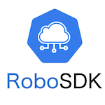
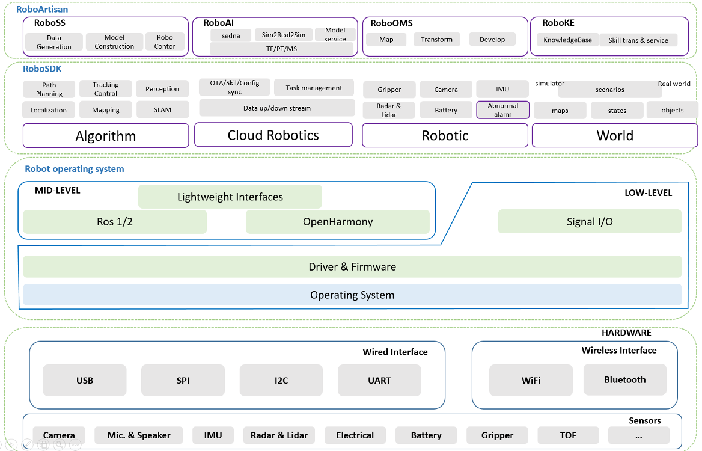

## RoboSDK

### [](https://github.com/kubeedge/robosdk)

Welcome to RoboSDK, an open-source cloud-native robotics toolchain designed to empower developers in building cutting-edge robotics applications. This README provides an overview of the project and its objectives, guiding developers on how to get started, and encouraging community engagement.

**Table of Contents**
1. [Introduction](#introduction)
2. [Features](#features)
3. [Architecture](#architecture)
4. [Getting Started](#getting-started)
5. [Usage Examples](#usage-examples)
6. [Community](#community)
7. [Cite Us](#cite-us)
8. [Roadmap](#roadmap)
9. [Contributing](#contributing)
10. [License](#license)


### Introduction

`RoboSDK` is a cloud-native robotics development platform that aims to simplify and democratize the creation of sophisticated robotics applications. It provides a hardware-agnostic environment and middleware-based approach to seamlessly integrate cloud services with various robot operating systems. 

`RoboSDK` empowers developers of all skill levels to innovate and unleash the potential of cloud-native robotics in diverse industries.

The goal of this project is to abstract away the low-level controls for developing APPs that runs on robots in an easy-to-use way.

### Features

- **Hardware Abstraction**: Bridge the gap between diverse robot hardware and simplify integration with standardized interfaces.
- **Middleware Compatibility**: Seamlessly interact with various robot operating systems, including [ROS 1](https://wiki.ros.org/), [ROS 2](http://docs.ros.org/), and [OpenHarmony](https://www.openharmony.cn/).
- **Cloud Integration**: Access powerful cloud resources for advanced robotics functionalities, such as `Object Storage Service` and `Real-Time Communication`.
- **Simulators Interfacing**: Interact with simulators such as [Gazebo](http://gazebosim.org/) and [Pybullet](https://pybullet.org/wordpress/).
- **Factory Registry**: Encourage modular contributions by providing a user-friendly development experience.


### Architecture


  

### Getting Started

Let’s walk through setting up a robot with a camera to complete a simple application development based on `RoboSDK`.

<details>
<summary>Installation</summary>
- Prerequisites
  - Robot Operating System: such as [Ros noetic](http://wiki.ros.org/noetic/installation/ubuntu) 

- Enable Virtual Environment
  - Mac OS / Linux

    ```sh
    # If your environment is not clean, create a virtual environment firstly.
    python -m venv robo_venv
    source ./robo_venv/bin/activate
    ```

  - Windows

    ```powershell
    # If your environment is not clean, create a virtual environment firstly.
    python -m venv robo_venv

    # You may need this for SecurityError in PowerShell.
    Set-ExecutionPolicy -Scope CurrentUser -ExecutionPolicy Unrestricted

    # Activate the virtual environment.
    .\robo_venv\Scripts\activate
    ```
    
- Install `RoboSDK`

    ```sh
  # Git Clone the whole source code.
  git clone https://github.com/kubeedge/robosdk.git
  
  # Build the pip package
  python3 setup.py bdist_wheel
    
  # Install the pip package 
  pip3 install dist/robosdk*.whl
  ```
</details>

<details>
<summary>Simple application development</summary>

#### Transmitting Robot's vision to the cloud

- Step 1: Configure Robot with yaml file

  ```yaml
  # demo.yaml
  name: "demo"
  environment:
    backend: "ros1"
    requirement:
      - rospy
      - rostopic
      - roslib
  sensors:
    camera:
      - name: "cam1"
        config: "simplecamera"
        rgb:
          target: "/usb_cam_1/image_raw"
          actual_hz: 10
          origin_hz: 30
          is_compressed: false
        info:
          target: "/usb_cam_1/camera_info"
  control:
    - motion:
      name: "ros_cmd_vel"
      config: "cmd_vel"
  ```

- Step 2: Write a simple application

  ```python
  # demo.py

  import cv2
  import time

  from robosdk.core.robot import Robot
  from robosdk.common.fileops import FileOps


  def main():
      robot = Robot(name="my_robot", config="demo")
      robot.connect()

      total_img = 10
      wait_time = .2
      upload_target = "s3://test"

      while total_img:
          time.sleep(wait_time)

          rgb, timer = robot.camera.get_rgb()
          if rgb is None:
              continue

          _ = cv2.imwrite(f"./{timer}.png", rgb)
          FileOps.upload(f"./{timer}.png", f"{upload_target}/{timer}.png")

          total_img -= 1
  ```

- Step 3: Run the application

  ```sh

  source ./robo_venv/bin/activate
  source /opt/ros/noetic/setup.bash

  python3 demo.py
  ```
</details>

### Usage Examples

- Case I - [Legged-Robot Auto Gait Change](./examples/ysc_x20/auto_gait_change)
- Case II - [Arm-Robot Teleoperation](./examples/scout_arm/teleoperation)


### Community

Join the KubeEdge Sig Robotics community! Engage in discussions, share ideas, and collaborate with like-minded developers. Feel free to reach out to us through [this documents](https://github.com/kubeedge/community/tree/master/sig-robotics).


### [Cite Us](./CITATION)

### [Roadmap](./docs/source/proposals/roadmap.md)

### [Contributing](./CONTRIBUTING.md)

### License

Copyright 2021 The KubeEdge Authors. All rights reserved.

Licensed under the [Apache License](./LICENSE), Version 2.0.