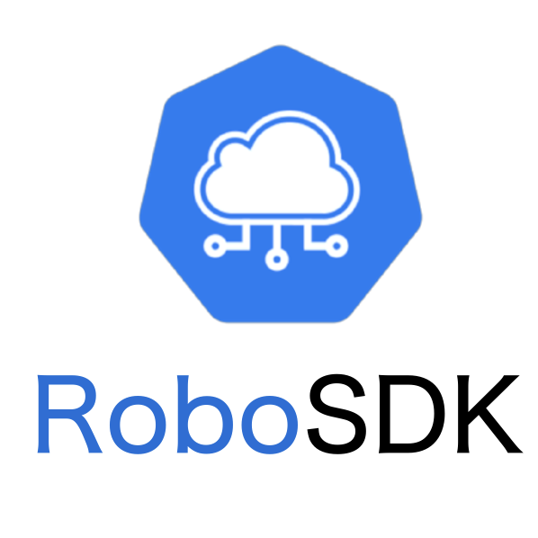

What is RoboSDK?
========================================================================================================================



`RoboSDK` is a light weight, high-level interface which provides hardware independent APIs for robotic control and perception.
The goal of this project is to abstract away the low-level controls for developing APPs that runs on an industrial robot in an easy-to-use way.

Components
---------------

- core: Root class for robots and worlds
    * Robot: This class builds robot specific objects by reading a configuration and instantiating the necessary robot module objects.
    * World: Word instance defines the environment which the robot launch, such as map.
- sensors: Here are the wrapper definitions of sensor modules, All sensors base class should extend the abstract class, for example:
    * Camera:
        - get_rgb: This function returns the RGB image perceived by the camera.
        - get_depth: This function returns the depth image perceived by the camera.
        - get_intrinsics: This function returns the camera intrinsics.
        - get_point_cloud
- backend: system-level encapsulation, such as: ros 1/2, openHarmony
- algorithm: Plug-in-and-play, see [above](#Features).
- cloud_robotics: Features of Edge-Cloud Collaboration
- common:
    * file_ops: Encapsulation of Multiple File Transfer Protocols: s3, http(s), local
    * logger: Cloud-based synchronization and management of run logs
    * class_factory: Two classes are defined in class_factory.py, namely ClassType and ClassFactory.
      `ClassFactory` can register the modules you want to reuse through decorators. Developer can customized new algorithm / robotics-controller by add a line of ClassFactory.register() to complete the registration.

Quick Start
-------------

.. code-block:: python3

    ```
    Capture several pictures and upload them to the specified obs url
    ```

    import cv2
    import time

    from robosdk.core.robot import Robot
    from robosdk.common.fileops import FileOps


    def main():
        robot = Robot(name="x20", config="ysc_x20")
        robot.connect()

        total_img = 10
        wait_time = .2
        upload_target = "s3://test"

        while total_img:
            time.sleep(wait_time)

            rgb, timer = robot.camera.get_rgb()
            if rgb is None:
                continue

            _ = cv2.imwrite(f"./{timer}.png", rgb)
            FileOps.upload(f"./{timer}.png", f"{upload_target}/{timer}.png")

            total_img -= 1

Contents
----------

.. toctree::
    :maxdepth: 2
    :caption: Installation

    installation/pip_install.rst
    installation/k8s_cluster_provisioning.rst

.. toctree::
    :maxdepth: 2
    :caption: Examples

    examples/scout-arm.rst
    examples/ysc-x20.rst

.. toctree::
    :maxdepth: 2
    :caption: Components

    components/sensors.rst
    components/backend.rst
    components/cloud_robotics.rst
    components/common.rst

.. toctree::
    :maxdepth: 4
    :caption: API Documents

    apidoc/robosdk.rst
