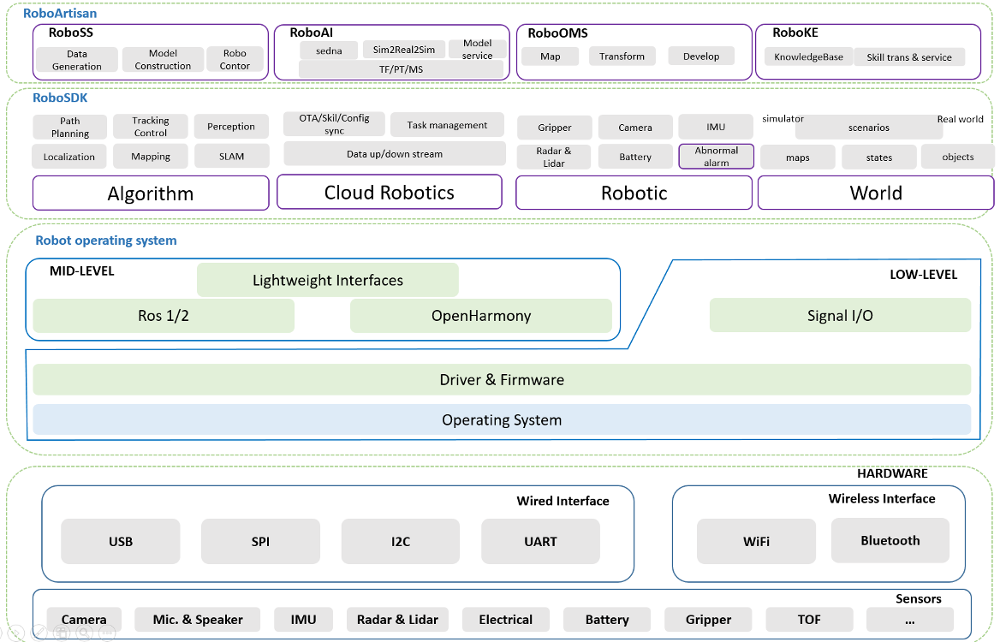

# RoboSDK Project Design

## Architecture Overview

`RoboSDK` is designed as a cutting-edge, cloud-native robotics application development ecosystem that simplifies the creation of complex robot applications. The architecture revolves around three core pillars: hardware abstraction, cloud service integration, and cross-platform support for various robot operating systems.



### Hardware Abstraction Layer

`RoboSDK`'s hardware abstraction layer serves as a bridge between developers and diverse robot hardware. It provides a standardized interface for accessing and controlling various sensors and actuators, regardless of the underlying hardware. This abstraction simplifies hardware integration, allowing developers to focus on the higher-level aspects of their applications without worrying about hardware-specific intricacies.

By abstracting hardware interactions, `RoboSDK` promotes modularity and reusability, making it easier to create robot applications that are hardware agnostic. Whether you are working with different robots or upgrading hardware components, `RoboSDK`'s hardware abstraction layer ensures smooth integration and minimizes development effort.

`RoboSDK` instantiating robot with a simple YAML file, developers can easily control the robot's actions through the imperative programming, following provide a simple example for understanding, you can study from `robosdk::core::robot` in depth.

- Step 1: Create a robot instance with a YAML file.

```yaml
  # robot.yaml
  name: "demo"  # robot name 
  environment:  # robot operating system
    backend: "ros1"
    requirement:  # dependency python package
      - rospy
      - rostopic
      - roslib
  sensors:  # robot sensors
    camera:
      - name: "cam1"
        config: "simplecamera"  # reference to the camera configuration named `simplecamera`
        rgb:
          target: "/usb_cam_1/image_raw"
          actual_hz: 10
          origin_hz: 30
          is_compressed: false
        info:
          target: "/usb_cam_1/camera_info"
  control:  # robot control
    - motion:
      name: "ros_cmd_vel"
      config: "cmd_vel"
```

- Step 2: Instantiating the Robot

```python
  # demo.py
  from robosdk.core.robot import Robot

  robot = Robot(name="demo", config="robot")
  robot.connect()  # initialize the robot by connecting to the sensors and actuators
```

- Step 3: Control the Robot

```python
  # demo.py
   
  robot.motion.go_forward()  # move the robot forward

  rgb, timer = robot.camera.get_rgb()  # get the rgb image from the primary camera
```


### Cloud Service Integration

The framework offers built-in interfaces for cloud service providers, allowing developers to easily tap into cloud resources and deploy sophisticated algorithms. This integration unlocks the potential of data-intensive tasks, such as advanced data analysis, machine learning, and simulations, without overloading the robot's onboard resources.

`RoboSDK` support the usual cloud-native functionalities by providing seamless integration with `RoboArtisan`'s existing cloud services, including `RoboOMS` (Robot Operation Management Service) and `RoboSS` (Robot Simulation Service), also support cloud-based `object storage` and `real-time audio and video`. This middleware-based approach empowers developers to efficiently utilize these cloud resources and access them through the `RoboSDK`.

More details by visiting `robosdk::cloud_robotics`.


### Cross-Platform Support

`RoboSDK` is designed to support different robot operating systems, such as ROS 1, ROS 2, and openHarmony, fostering a collaborative and inclusive robotics community. By providing compatibility across various platforms, developers can work on their preferred robotic environments without worrying about compatibility issues.

More details by visiting `robosdk::backend`.


## Modular Development Workflow

`RoboSDK` encourages a modular development workflow, allowing developers to focus on specific functionalities or capabilities. Each module within `RoboSDK` can be developed independently, promoting collaboration and enabling developers to contribute expertise in their areas of interest.

The framework's modular approach also simplifies testing and debugging, making it easier to maintain and update individual components. This modularity enhances the overall stability and flexibility of `RoboSDK`, promoting the growth of the open-source robotics community.

A sample is provided below, more details by visiting `robosdk::common::class_factory`.

**For Navigation Algorithm Developers**

```python
  # demo.py
  from robosdk.common.class_factory import ClassFactory
  from robosdk.common.class_factory import ClassType
  

  @ClassFactory.register(ClassType.NAVIGATION, alias="my_navigation")
  class MyAlgorithm:
      def __init__(self, config: str):
          pass

      def planning(self, step=0) -> PoseSeq:
          pass

```

**For Navigation Algorithm Users**

```python
  # demo.py
  alg_cls = ClassFactory.get_cls(
    ClassType.NAVIGATION,  "my_navigation"
  )

  navigation = alg_cls(config=alg_cfg)
  pose_seqs = navigation.planning()

  for inx, point in enumerate(pose_seqs):
      robot.motion.go_to(point)
```


